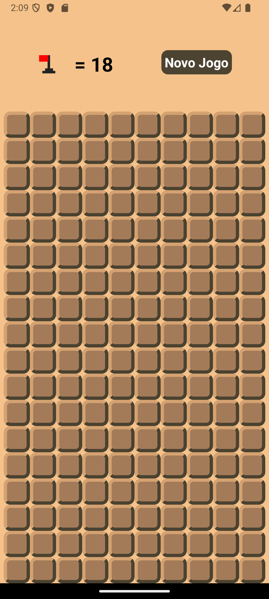
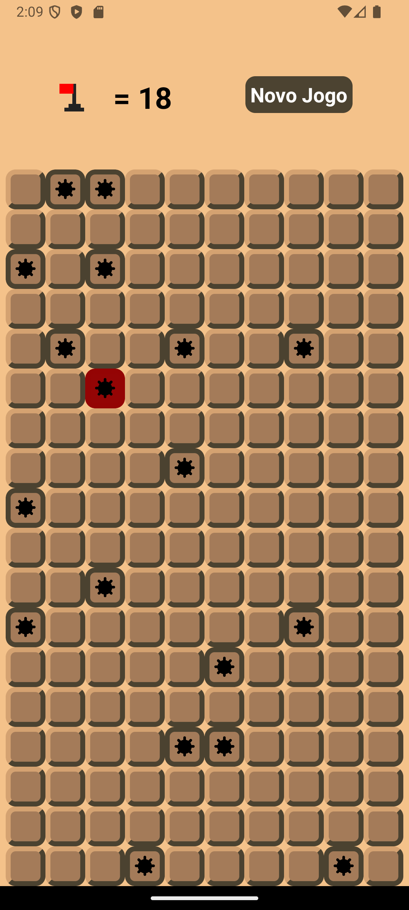
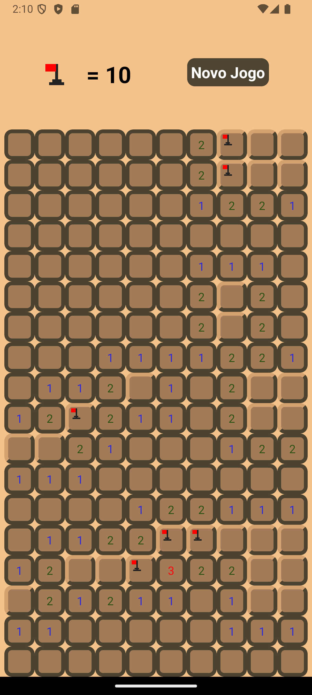
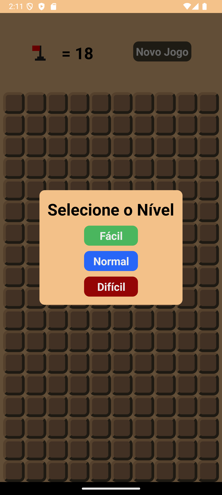
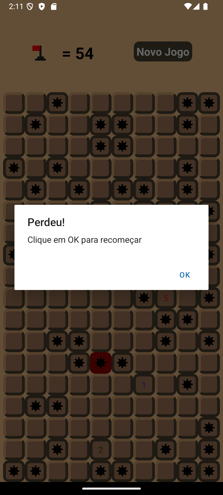

# 🧨 Campo Minado

Este é um jogo de **Campo Minado** desenvolvido como aplicativo mobile. O objetivo é encontrar todas as células seguras do tabuleiro sem explodir nenhuma mina!

## 📱 Tecnologias Utilizadas

- React Native
- JavaScript

## 🚀 Funcionalidades

- Geração automática do tabuleiro com minas aleatórias
- Níveis de dificuldade (fácil, médio, difícil)
- Sistema de bandeiras para marcar possíveis minas
- Detecção de vitória e derrota
- Interface responsiva e intuitiva

## 🛠️ Instalação

1. Clone o repositório:

```bash
git clone https://github.com/joaosouza14/campominado
```

2. Acesse a pasta do projeto:

```bash
cd campominado
```

3. Instale as dependências:

```bash
npm install
# ou
yarn
```

4. Execute o app:

```bash
npx react-native run-android
# ou
npx expo start
```

## 📸 Capturas de Tela





## ✨ Contribuição

Pull requests são bem-vindos! Para mudanças maiores, abra uma issue primeiro para discutir o que você gostaria de modificar.

## 📄 Licença

[MIT](./LICENSE)

---

Desenvolvido com 💣 por João Souza
